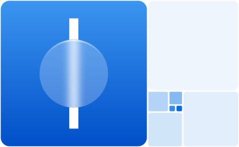

<p align="center">
  
</p>

<h1 align="center">aequitas</h1>

<p align="center">
  A CSS design language proportioned on the golden ratio.<br>
  Frosted glass where things float, flat tints where you click.
</p>

<br>

## One number

```css
--ae-phi: 1.618034;
```

Every measure is a power of it.

| Token                | Rule                                    |
| -------------------- | --------------------------------------- |
| space                | `1rem · φⁿ`                             |
| type                 | `base · φ^(n/2)`, line-height `φ`       |
| radius, blur, motion | `base · φⁿ`                             |
| tint                 | `7% · φⁿ` for rest, hover, press        |
| layout               | `.split` at `1 : φ`, container `φ⁹ rem` |

## Use

```html
<link rel="stylesheet" href="aequitas.css" />
<script type="module" src="aequitas.js"></script>

<button class="btn" data-variant="primary">Publish</button>
<button class="btn" aria-pressed="true">Pin</button>
```

Variants are `data-*` attributes and state is ARIA: there is no `.btn-primary` and no `.active`. Everything sits in `@layer ae.reset, ae.tokens, ae.base, ae.layout, ae.components, ae.utilities`, so any unlayered CSS of yours wins without `!important`.

## Components

| Group     | Classes                                                                                                                  |
| --------- | ------------------------------------------------------------------------------------------------------------------------ |
| Controls  | `.btn`, `.input`, `.select`, `.input-group`, checkbox, radio, switch, range, `.segmented`, `.tabs`, `.chip`, `.combobox` |
| Surfaces  | `.card`, `.list`, `.alert`, `.toast`, `.menu`, `.popover`, `dialog`, `dialog.drawer`, `dialog.palette`, `.navbar`        |
| Content   | `.badge`, `.avatar`, `.accordion`, `.table`, `.stat`, `progress`, `meter`, `.skeleton`, `.spinner`, `.empty`, `.steps`   |
| App       | `.shell`, `.sidebar`, `.page-header`, `.toolbar`, `.settings`, `.master-detail`, `.calendar`, `.tree`, `.thread`         |
| Layout    | `.container`, `.measure`, `.stack`, `.cluster`, `.split`, `.grid`, `.golden`, `.section`, `.center`, `.gap-1…8`          |
| Utilities | spacing, display, flex, grid, type and colour, with `s:` `m:` `l:` `xl:` breakpoint and `cq-*:` container variants       |
| Icons     | `<i class="icon" data-icon="search">`, 377 mask icons in `currentColor`, in a separate stylesheet                        |

The docs have a page for each, with live specimens, anatomy and the full API.

## Theming

Set these on `<html>`. Light and dark follow the OS unless `data-theme` says otherwise.

| Attribute      | Values                                                                            |
| -------------- | --------------------------------------------------------------------------------- |
| `data-theme`   | `light` `dark`                                                                    |
| `data-accent`  | `blue` `indigo` `purple` `pink` `red` `orange` `yellow` `green` `teal` `graphite` |
| `data-density` | `compact` `spacious`                                                              |
| `data-radius`  | `soft` `round`                                                                    |
| `data-type`    | `serif` `humanist` `mono`                                                         |

For any other colour, set `--ae-hue` and `--ae-neutral-hue`. Components take `data-tone="accent|success|warning|danger|info"`.

Controls answer the pointer with tone, never movement, and persistent states add a 2px accent edge so colour never carries meaning alone. Frost falls back to solid surfaces without `backdrop-filter` or under `prefers-reduced-transparency`; `prefers-contrast`, `forced-colors` and `prefers-reduced-motion` are handled throughout.

## Behaviours

`aequitas.js` is optional: about 5 kB gzipped, ESM, typed. It initialises itself; add `data-ae-manual` to `<html>` and call `init()` (or `bind()` once and `enhance()` after each render) to drive it yourself.

| Markup                                 | Does                                           |
| -------------------------------------- | ---------------------------------------------- |
| `[role=tablist]`                       | switches tabs on click and arrow keys          |
| `[data-open="#id"]`, `[data-close]`    | opens and closes dialogs and popovers          |
| `dialog[data-light-dismiss]`           | closes on a backdrop click                     |
| `[data-dismiss]`                       | removes the nearest alert, toast or chip       |
| `[data-toast]`                         | shows a toast with that message                |
| `[data-theme-set="light\|dark\|auto"]` | switches and remembers the theme               |
| `.combobox`, `dialog.palette`          | filters as you type, with arrow keys and Enter |
| `[data-copy]`                          | copies a code block                            |

```js
import { toast, setTheme } from "./aequitas.js";
toast("Northlight is live.", { title: "Published.", tone: "success" });
```

## Build

```sh
pnpm build        # dist/
pnpm dev          # dist/ on change, docs on :3000
pnpm build:site   # static docs in site/.output/public
```

| File in `dist/`                    | Contains                                           |
| ---------------------------------- | -------------------------------------------------- |
| `aequitas.css`                     | components, layouts and utilities                  |
| `aequitas.core.css`                | the same without utilities                         |
| `aequitas.icons.css`               | the icon set                                       |
| `aequitas.js`, `aequitas.d.ts`     | the behaviours                                     |
| `tokens.json`                      | every `--ae-*` token with its raw value            |
| `llms.txt`, `AGENTS.md`, `skills/` | the reference, written for coding agents           |
| `aequitas-check.mjs`               | checks markup against what the CSS actually styles |

Each stylesheet also ships as `.min.css`.
